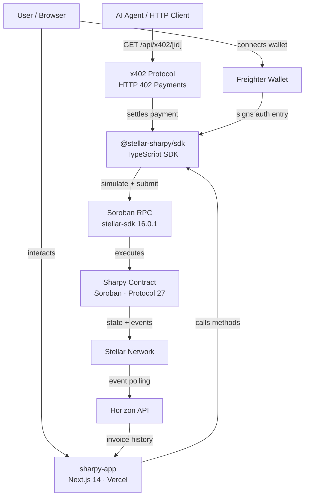

# Sharpy — Advanced Split Payment Protocol on Stellar

**Sharpy** is an open-source payment splitting protocol built on Stellar Soroban. It enables creators to issue on-chain invoices that automatically distribute funds to multiple recipients according to configurable rules — with recurring schedules, escrow protection, agentic payment support, and a full TypeScript SDK.


---

## Live

| | |
|---|---|
| **dApp** | [sharpy-sigma.vercel.app](https://sharpy-sigma.vercel.app) |
| **Testnet Contract** | [`CAYTIFPD6RFWVHMK5SPPUUIWWAAANHKOJB6GOAJS5SR5MBKZMEY2UODZ`](https://stellar.expert/explorer/testnet/contract/CAYTIFPD6RFWVHMK5SPPUUIWWAAANHKOJB6GOAJS5SR5MBKZMEY2UODZ) |
| **Mainnet Contract** | Coming soon |
| **npm** | `@stellar-sharpy/sdk` |
| **Pitch Deck** | [View on Gamma](https://gamma.app/docs/Split-Payments-on-Stellar-s0et8z1agtva59n) |

---

## Repositories

| Repo | Description | Language | Status |
|------|-------------|----------|--------|
| [sharpy-contracts](https://github.com/stellar-sharpy/sharpy-contracts) | Core Soroban smart contract | Rust | ✅ Testnet live |
| [sharpy-sdk](https://github.com/stellar-sharpy/sharpy-sdk) | TypeScript SDK | TypeScript | ✅ Published |
| [sharpy-app](https://github.com/stellar-sharpy/sharpy-app) | Next.js 14 frontend dApp | TypeScript | ✅ Vercel live |

---

## Architecture



---

## Features

### Invoice Management
- **Multi-recipient invoices** — split funds to any number of recipients in one transaction
- **Batch creation** — create up to 10 invoices in a single transaction
- **Recurring/subscription invoices** — auto-generate the next invoice on release
- **Cancel & refund** — creator can cancel and refund all payers at any time

### Payment & Settlement
- **Pay** — single payment toward an invoice
- **Pool pay** — pay multiple invoices in one call
- **Multi-token support** — USDC, XLM, AQUA, yXLM per recipient
- **x402 agentic payments** — AI agents and HTTP clients pay invoices via the HTTP 402 protocol

### Split Rules
| Type | Behaviour |
|------|-----------|
| `Fixed(amount)` | Pay exact amount regardless of funded total |
| `Percentage(bps)` | Pay `funded * bps / 10_000` (validated ≤ 100%) |
| `Tiered(threshold, bps)` | Pay percentage only if `funded > threshold` |

### Escrow & Security
- **Escrow protection** — hold funds with configurable release delay
- **Escrow dispute mechanism** — optional arbitrator can intervene before release
- **Audit log** — full on-chain audit trail per invoice
- **Admin circuit breaker** — pause/unpause contract

### Protocol 25/26 Features
| CAP | Protocol | Feature |
|-----|----------|---------|
| CAP-82 | 26 | Checked arithmetic in all split calculations — overflow-safe |
| CAP-78 | 26 | `bump_invoice_ttl` — prevent archival of long-lived invoices |
| CAP-75 | 25 | `get_invoice_fingerprint` — SHA-256 tamper-evident content hash |

### Frontend
- Public shareable `/pay/[id]` page — no login required to view
- Dashboard with search and filter
- QR code for invoice payment links
- Copy-to-clipboard for invoice URLs
- Transaction confirmation step indicators
- Dark/light mode with system preference detection
- Public on-chain verification page (`/verify/[id]`) with fingerprint display

---

## Quick Start

### Install SDK

```bash
npm install @stellar-sharpy/sdk
```

### Create and pay an invoice

```typescript
import { SharpyClient, connectWallet, parseAmount, deadlineFromDays, NETWORKS } from "@stellar-sharpy/sdk";

// Connect Freighter wallet
const publicKey = await connectWallet();

// Initialize client (testnet pre-configured)
const client = new SharpyClient(NETWORKS.testnet);

// Create a split invoice — 60/40 between two recipients
const { invoiceId } = await client.createInvoice({
  creator: publicKey,
  recipients: [
    { address: "GABC...RECIPIENT1", amount: parseAmount("60") },
    { address: "GDEF...RECIPIENT2", amount: parseAmount("40") },
  ],
  token: NETWORKS.testnet.contractId,
  deadline: deadlineFromDays(7),
});

// Pay the invoice
await client.pay(publicKey, invoiceId, parseAmount("100"));

// Check status
const invoice = await client.getInvoice(invoiceId);
console.log(invoice.status); // "Released"
```

### x402 Agentic Payment (AI agents / HTTP clients)

```bash
# Any HTTP client or AI agent can pay an invoice:
curl -i https://sharpy-sigma.vercel.app/api/x402/1
# → 402 Payment Required with payment requirements

# After signing auth entry:
curl -X POST https://sharpy-sigma.vercel.app/api/x402/1 \
  -H "X-Payment: <signed-payload>"
# → 200 OK with receipt
```

---

## Contract Functions

| Function | Description |
|----------|-------------|
| `initialize(admin, treasury)` | Set admin and treasury addresses |
| `create_invoice(...)` | Create invoice with split rules and escrow options |
| `create_batch(...)` | Create up to 10 invoices in one transaction |
| `create_recurring(...)` | Create recurring invoice with auto-generation |
| `pay(payer, invoice_id, amount)` | Pay toward an invoice |
| `pool_pay(payer, payments)` | Pay multiple invoices in one call |
| `release_escrow(invoice_id)` | Release after escrow delay passes |
| `release(invoice_id)` | Manual release for fully funded invoice |
| `refund(invoice_id)` | Refund payers after deadline |
| `cancel_invoice(caller, invoice_id)` | Creator cancels and refunds |
| `get_invoice(id)` | Read full invoice state |
| `get_invoice_stats(id)` | Funded/total/completion_bps/unique_payers |
| `get_invoice_fingerprint(id)` | SHA-256 tamper-evident content hash |
| `get_audit_log(id)` | Full audit trail |
| `get_payer_total(id, payer)` | Total paid by a specific address |
| `get_next_recurring(id)` | Next invoice in recurring chain |
| `bump_invoice_ttl(id)` | Extend invoice storage TTL (Protocol 26 CAP-78) |
| `dispute_release(invoice_id)` | Raise escrow dispute |
| `resolve_dispute(invoice_id, release)` | Arbitrator resolves dispute |
| `pause / unpause` | Admin circuit breaker |

---

## Protocol Compatibility

| soroban-sdk | stellar-sdk | Protocol | Notes |
|-------------|-------------|----------|-------|
| 26.1.0 | 16.0.1 | 27 ✅ | Current — CAP-71 auth delegation ready |

---

## Contributing

We welcome contributions across all three repositories. See each repo's `CONTRIBUTING.md` for setup instructions.

- [Contract contributing guide](https://github.com/stellar-sharpy/sharpy-contracts/blob/main/CONTRIBUTING.md)
- [SDK contributing guide](https://github.com/stellar-sharpy/sharpy-sdk/blob/main/CONTRIBUTING.md)
- [App contributing guide](https://github.com/stellar-sharpy/sharpy-app/blob/main/CONTRIBUTING.md)

Please read our [Code of Conduct](https://github.com/stellar-sharpy/sharpy-contracts/blob/main/CODE_OF_CONDUCT.md) before contributing.

---

## Security

To report a vulnerability, please use the [GitHub Security Advisory](https://github.com/stellar-sharpy/sharpy-contracts/security/advisories/new) — do not open a public issue.

---

## License

MIT License — see [LICENSE](https://github.com/stellar-sharpy/sharpy-contracts/blob/main/LICENSE)

---

Built on [Stellar](https://stellar.org) · Protocol 27 · Soroban
