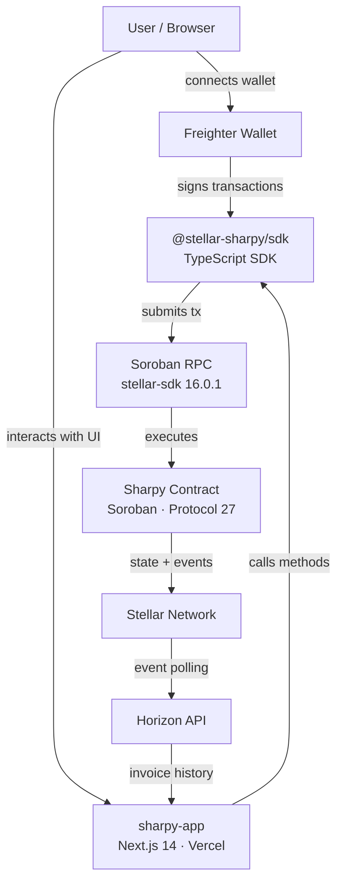

# Sharpy — Split Payments on Stellar

Advanced on-chain payment splitting for the Stellar ecosystem.

Sharpy lets you create invoices that automatically distribute funds to multiple recipients — with recurring schedules, escrow protection, multi-token support, and flexible split rules. Built on Stellar Soroban, Protocol 27 ready.

---

## Live

| | |
|---|---|
| dApp | [sharpy-sigma.vercel.app](https://sharpy-sigma.vercel.app) |
| Testnet Contract | [CAYTIFPD6...](https://stellar.expert/explorer/testnet/contract/CAYTIFPD6RFWVHMK5SPPUUIWWAAANHKOJB6GOAJS5SR5MBKZMEY2UODZ) |


## Architecture



---

## Repositories

| Repo | Description | Status |
|------|-------------|--------|
| [sharpy-contracts](https://github.com/stellar-sharpy/sharpy-contracts) | Soroban smart contract — Rust, soroban-sdk 26.1.0 | ✅ Protocol 27 |
| [sharpy-sdk](https://github.com/stellar-sharpy/sharpy-sdk) | TypeScript SDK — stellar-sdk 16.0.1 | ✅ Protocol 27 |
| [sharpy-app](https://github.com/stellar-sharpy/sharpy-app) | Next.js 14 frontend dApp | ✅ Live |

---

## Features

- Recurring invoices — auto-generate next invoice on release
- Escrow protection — configurable delay with optional arbitrator
- Batch operations — up to 10 invoices in one transaction
- Split rules — Fixed, Percentage (validated), and Tiered distributions
- Multi-token support — USDC, XLM, AQUA, yXLM
- Pool payments — pay multiple invoices in one call
- Invoice stats — funded/total/completion tracking
- Full audit log per invoice
- QR codes and shareable invoice links
- Dark/light mode

---

## Quick Start

```typescript
import { SharpyClient, connectWallet, parseAmount, NETWORKS } from "@stellar-sharpy/sdk";

const publicKey = await connectWallet();
const client = new SharpyClient(NETWORKS.testnet);

const { invoiceId } = await client.createInvoice({
  creator: publicKey,
  recipients: [{ address: "GABC...", amount: parseAmount("100") }],
  token: "USDC_CONTRACT_ID",
  deadline: Date.now() / 1000 + 7 * 86400,
});
```

---

## Protocol Compatibility

| soroban-sdk | stellar-sdk | Protocol |
|-------------|-------------|----------|
| 26.1.0 | 16.0.1 | 27 ✅ |

---

MIT License · Built on [Stellar](https://stellar.org)
